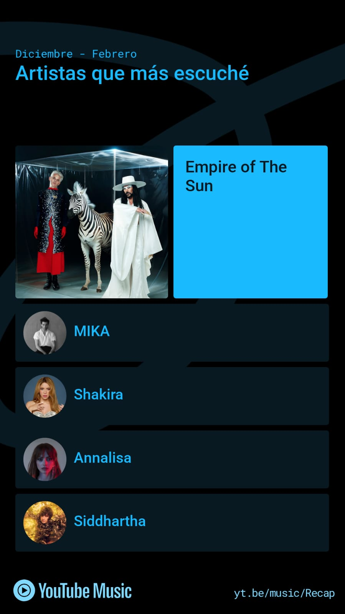
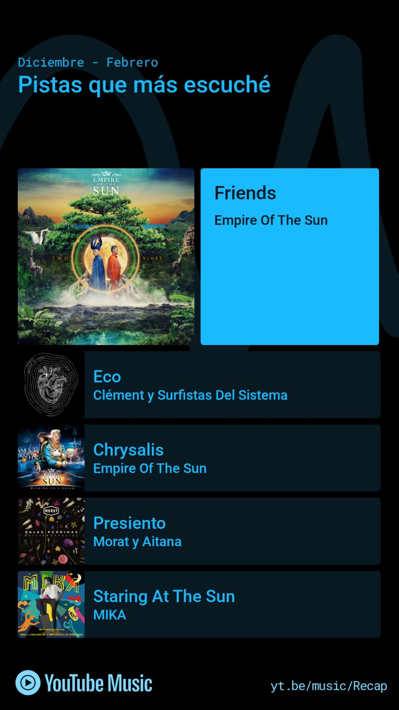
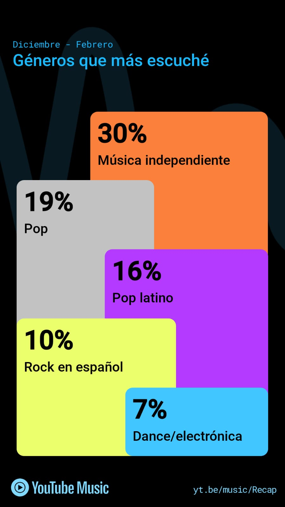
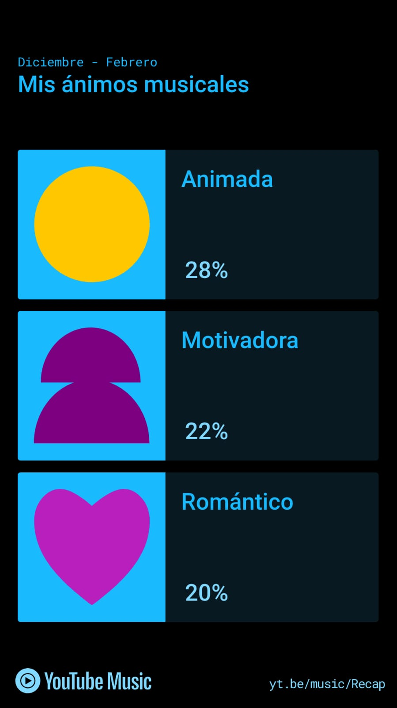

# Música

## 📈 Algunos datos de mi recap de Diciembre a Febrero 2025

### Hola, aquí podrás encontrar: 
⭐ Mis artistas más escuchados.

⭐ Mis canciones más reproducidas.

⭐ Géneros principales de acuerdo al recap.

⭐ Mis estados de ánimo de acuerdo a la música que escuché.

## Aquí hay una clasificación random de canciones por género:

### 🎵 Clasificación de canciones por género:

**🎸 Rock**
- *Bohemian Rhapsody* – Queen  
- *Smells Like Teen Spirit* – Nirvana  
- *Sweet Child O’ Mine* – Guns N’ Roses  v

**🎤 Pop**
- *Blinding Lights* – The Weeknd  
- *Levitating* – Dua Lipa  
- *As It Was* – Harry Styles  

**🎧 Electrónica**
- *Strobe* – Deadmau5  
- *Titanium* – David Guetta ft. Sia  
- *Animals* – Martin Garrix  

**🎶 Reggaetón / Urbano**
- *Safaera* – Bad Bunny  
- *Hawái* – Maluma  
- *Felices los 4* – Maluma  

**🎻 Clásica**
- *Canon in D* – Pachelbel  
- *Clair de Lune* – Debussy  
- *La Primavera* – Vivaldi  

---
¡Hola! Soy ***Gerardo***: Ya que veo que te gusta algo de rock viejito, te recomiendo los álbumes de *Iron Maiden* o de *Nightwish* justamente de alrededor de los años 2000. Son los álbumes que más disfruto de esos años. 🎧 

Hola, soy **Jessi**. 🟦 Te recomiendo: **Robbers - The 1975** 🫐

Te recomiendo mucho artistas como Fleetwood Mac, The Beatles, Pink Floyd, The Rolling Stones, Queen, entre otros. P.D YouTube Music GOD ATTE: **Emiliano**

Holis, soy **Dey**: Que geniales gustos, igual me encanta Empire of The Sun, y wow lo que dice Gerardo de *Nightwish* muy buna banda jsjsjs. Yo te recomiendo a *Milky Chance*  

Wenass, soy **Crizzz**. Me agradan esos justos musicales, muy variados ;). Si me permites una recomendación, Justice es muy muy bueno. Deberias checarlo. Saluditos!!
